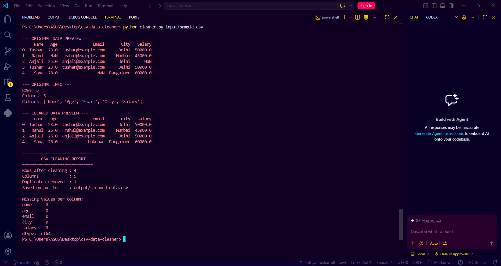

# CSV Data Cleaner & Analyzer

A Python automation tool that cleans messy CSV files, removes duplicate rows, fills missing values, and saves a cleaned output file.

## What this project does
This tool helps users quickly clean spreadsheet data that has:
- duplicate rows
- missing values
- messy column names
- inconsistent formatting

## Features
- Reads CSV files
- Cleans column names
- Removes duplicates
- Fills missing values
- Saves cleaned CSV
- Prints a basic report

## Technologies Used
- Python 3
- pandas
- argparse
- pathlib

## Folder Structure
```text
csv-data-cleaner/
├── cleaner.py
├── requirements.txt
├── README.md
├── .gitignore
├── input/
├── output/
└── screenshots/
```

## How to Run

### Install dependencies
```bash
pip install pandas
```

### Run the script
```bash
python cleaner.py input/sample.csv
```

### Save to custom output
```bash
python cleaner.py input/sample.csv -o output/final_cleaned.csv
```

## Example Output
```text
Duplicates removed: 1
Cleaned file saved to: output/cleaned_data.csv
```
## Screenshots

### Terminal Output


## Why this is useful
Many clients work with CSV files from Excel, Google Sheets, exports, or CRM tools.  
These files are often messy and need quick cleanup before analysis or reporting.

## Future Improvements
- Add CSV validation
- Add data type detection
- Add charts and summaries
- Add GUI
- Support Excel files

## License
MIT